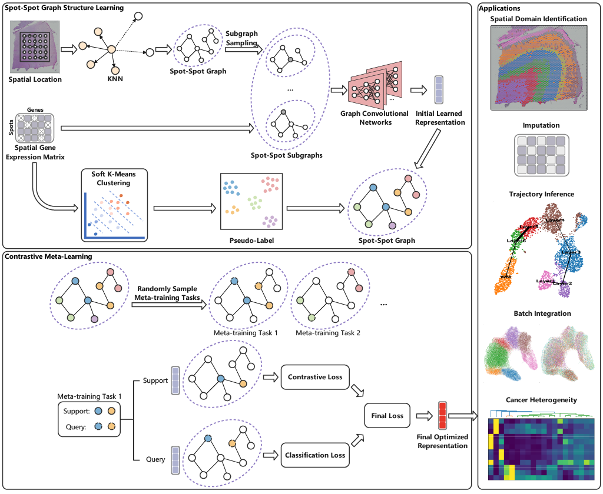

# GatorST: A Versatile Contrastive Meta-Learning Framework for Spatial Transcriptomic Data Analysis


## Requirements
- python : 3.9.12
- scanpy : 1.10.3
- sklearn : 1.1.1
- scipy : 1.9.0
- torch : 1.11.2
- torch-geometric : 2.1.0
- numpy : 1.24.4
- pandas : 2.2.3


## Project Structure

```bash
.
├── main.py            # Main training and evaluation loop
├── model.py           # Model architecture and loss functions
├── data_loader.py     # Data loading and graph construction utilities
├── utils.py            # Utility functions (seed setup, metrics, dropout)
├── data/              # Folder for .h5ad input files
├── saved_models/      # Folder to save trained models
└── result.json        # Evaluation results output
```

## Usage

### **1. Prepare your input data**

Place your **.h5ad** spatial transcriptomics datasets in the `./data/` directory.

Each `.h5ad` file should contain:

* **`adata.X`** – Gene expression matrix
* **`adata.obs`** – Cell/Spot metadata.
  The loader automatically searches typical label fields:

  ```
  ['ground_truth']
  ```

  and maps them to integer class indices. 
* **`adata.obsm["spatial"]`** – Spatial coordinates (N × 2)

The pipeline will automatically:

* Construct a **graph** by linking top-k similar neighbors (default degree: 3)
* Extract **2-hop subgraphs** per cell with node remapping and edge lists
* Split into **train / validation / test**
* Produce PyTorch loaders with subgraphs

Example dataset folder:

```bash
data/
 ├── 151507.h5ad
 ├── human_breast_cancer.h5ad
 └── mouse_brain_anterior.h5ad
```

---

### **2. Run training and evaluation**

Execute the main script to train and evaluate across datasets:

```bash
python main.py
```

#### Optional configuration inside `main.py`:

* `epochs`: number of training epochs per run 
* `batch_size`: number of samples per batch
* `lr`: learning rate 
* `runs`: repeated random seed experiments 

You can modify these directly in `main.py`:

```python
epochs = 50
batch_size = 20
lr = 0.001
```

To run only selected datasets, edit the filtering condition:

```python
if data_name not in ['151507']:
    continue
```

---

### **3. Output files**

After training completes:

* Trained model checkpoints: `saved_models/`

  ```
  saved_models/
   ├── 151507_model_run_0.pt
   ├── 151507_model_run_1.pt
   ...
  ```
* Evaluation results (accuracy, clustering, etc.): `result.json`

  ```json
  {
      "151507": ["ARI":,...],
      "human_breast_cancer": ["ARI":,...],
          ...
  }
  ```
* Intermediate subgraph structures (optional): `saved_graphs/`

---

### **4. Run-time behavior**

When executed, the program automatically:

1. Iterates through each `.h5ad` file in `./data/`
2. Builds train/validation/test DataLoaders via `loader_construction()`
3. Runs `train()` for multiple seeds and saves the best checkpoint per run
4. Evaluates the model using `test()`
5. Logs all metrics to `result.json`


## Datasets
The spatial transcriptomics datasets analyzed in this study are publicly available from the following sources: the LIBD human dorsolateral prefrontal cortex (DLPFC) dataset, which was obtained using the 10x Visium platform (http://research.libd.org/spatialLIBD/); human lymph node Visium dataset acquired from tissue containing germinal centers (GCs) and obtained from GEO (accession no. GSE263617); the human breast cancer dataset (https://www.10xgenomics.com/datasets/human-breast-cancer-block-a-section-1-1-standard-1-1-0) and the mouse brain tissue dataset (https://www.10xgenomics.com/datasets/mouse-brain-serial-section-1-sagittal-anterior-1-standard-1-1-0), both obtained from the 10x Genomics Data Repository. In addition, we used an E9.5 mouse embryo dataset generated with Stereo-seq and downloaded from the MOSTA resource (https://db.cngb.org/stomics/mosta/), a Stereo-seq dataset of mouse olfactory bulb (https://github.com/JinmiaoChenLab/SEDR_analyses), and a mouse hippocampus dataset profiled with Slide-seqV2 (https://portals.broadinstitute.org/single_cell/study/slide-seq-study).

##  Cross-Validation Strategy

To ensure robustness and generalizability across different tissue sections and data distributions, GatorST employs a **multi-run cross-validation approach**.

Specifically:

* For each dataset, the data loader (`loader_construction`) partitions samples into **train**, **validation**, and **test** sets using fixed proportions (80% / 10% / 10%).
* This process is **repeated across 10 random seeds** (`for run in range(10)`) to assess consistency.
* Each run reinitializes the model and randomizes data splits, ensuring that results reported in `result.json` reflect **average and variance** across independent splits.

This strategy provides a fair approximation of cross-validation while maintaining efficiency for large-scale ST datasets.

##  Parameter Setting

```
epochs = 50
batch_size = 20
lr = 0.001
alpha = 0.5
gamma = 0.2
N_way = 5
M_shot = 5
Q_query = 5
tau = 1.0 
```

To reproduce the results in an end-to-end manner, execute the main script to train and evaluate across datasets. The seeds are pre-defined in the main.py file.

```bash
python main.py
```
